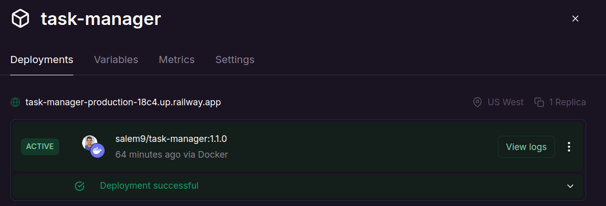

# Task Management RESTful API

A Task Management API built with Node.js, Express, MongoDB, and JWT for authentication and authorization. This application allows users to create, update, delete, and manage tasks while offering different levels of access for admins and regular users.

## Features

- **User Authentication & Authorization**: Users can register, log in, and authenticate using JWT. Admin users have extended access to manage all users and tasks.
- **Task Management**: Users can create, view, update, and delete their tasks.
- **Filter & Sort Tasks**: Users can filter and sort tasks by various criteria (`status`, `priority`, `dueDate`)
- **Admin Access**: Admin users can view, update, and delete any user or task in the system.

## Tech Stack

- **Backend**: Node.js with Express
- **Database**: MongoDB (via Mongoose)
- **Hosting**: Railway throuh [link](https://task-manager-production-18c4.up.railway.app/check)
- **Authentication**: JWT (JSON Web Tokens)
- **Validation**: AJV (JSON Schema validation)
- **Environment Variables**: dotenv
- **Logging**: Winston package with custom middleware for request logging

## Database Hosting
This project uses [MongoDB Atlas](https://www.mongodb.com/products/platform/atlas-database) for database hosting. MongoDB Atlas is a cloud-based, fully managed database as a service (DBaaS) that offers a free tier, making it ideal for development and small-scale projects.

Running Cluster: 


## Installation

1. Clone the repository:

   ```bash
   git clone https://github.com/yourusername/task-management-app.git
   cd task-management-app
   ```
2. Install dependencies:
    ```bash
    npm install
    ```

3. Create a `.env` file in the root directory and add the following environment variables:
    ```bash
    DATABASE_URL=mongodb://your-mongo-db-url
    PORT=5000
    SECRET_KEY=your-secret-key-for-jwt
    ```
    - DATABASE_URL: MongoDB connection string (can be a local MongoDB or MongoDB Atlas URL).
    - PORT: Port for the server to run on (default is 5000).
    - SECRET_KEY: A secret key used to sign JWT tokens.
4. Run the application: 
    ```bash
    npm start
    ```
    The app will be available at http://localhost:5000.

## API Endpoints

### **User Routes**
- `POST /user`: Create a new user (Registration).
- `GET /user`: Get all users (Admin access only).
- `GET /user/:id`: Get a specific user by ID.
- `PUT /user/:id`: Update user details (Admin access only).
- `DELETE /user/:id`: Delete a user (Admin access only).

### **Login Routes**
- `POST /login`: Log in a user and get a JWT token.

### **Task Routes**
- `POST /tasks`: Create a new task.
- `GET /tasks`: Get a list of tasks with optional filtering and sorting.
- `GET /tasks/:title`: Get a specific task by its title.
- `PUT /tasks/:title`: Update a specific task by its title.
- `DELETE /tasks/:title`: Delete a task by its title.

## Middleware

- **Authentication Middleware**: Ensures only authenticated users can access protected routes.
- **Authorization Middleware**: Admin-specific routes are protected by checking if the user is an admin via JWT.
- **Task Validation Middleware**: Ensures incoming task data is valid based on a predefined schema.
- **Logging Middleware**: Logs each HTTP request for debugging and monitoring purposes.

## Validation

We use **AJV** for input validation throughout the application. Every route that receives user input, such as creating a user or creating a task, will validate the data against a JSON predefined schema.

## Testing
This project includes comprehensive testing using **Mocha** as the test framework and **Chai** as the assertion library. The tests ensure the correctness of the API endpoints, including CRUD operations, user authentication,admin permissions and task management.

### 📋 Features Tested
1. User API:
    - User creation with validation (`POST /user`)
    - User retrieval by ID (`GET /user/:id`)
    - Unauthorized access handling (`GET /user`)
    - User login functionality (`POST /login`)
2. Task API:
    - CRUD operations:
    - Creating tasks for authenticated users
    - Retrieving tasks by title (owner-only access)
    - Updating tasks (owner-only access)
    - Deleting tasks (owner-only access)
3. Admin User API:
    - Admin permissions for retrieving all users (`GET /user`)
    - Admin-only updates to user details (`PUT /user/:id`)
    - Admin-only deletion of users (`DELETE /user/:id`)
4. Filtering and sorting:
    - Filter tasks by `status`, `priority`, `dueDate`, or `createdAt`
    - Sort tasks by priority or other criteria

5. Sever Healthcheck
    - Hosting platforms can access (`/check`) to test whether the server is up and running or   face issues.

### 🛠️ Tools Used
- Postman: Http client for API testing during development. 
- Mocha: Test framework for defining and executing tests.
- Chai: Assertion library for verifying test outcomes.
- Chai-HTTP: Middleware for testing HTTP API endpoints.
- JSON Web Tokens (JWT): Used for simulating authenticated requests.
### 🚀 Running the Tests
To run the tests locally, ensure the following prerequisites are met:

1. Node.js and npm are installed.
2. A .env.test file is configured with a `SECRET_KEY` for JWT generation with the testing `DATABASE_URL`.
3. MongoDB is running and accessible.
4. run the following command: 

    ```bash
    npm test
    ```
    output: 
    


## Dockerizing
This project has been dockerized to streamline deployment and make it platform-independent. By using Docker, you can quickly build and run the application in a containerized environment.

dockerhub  image: 


### Use the Docker Image
1. You can pull the Docker image directly from DockerHub by run the following command:
    ```bash
    docker pull salem9/taskmanager:1.1.0
    ```
2. Run the Docker Container
    ```bash
    docker container run -p <YOUR_PREFERED_PORT>:3000 salem9/taskmanger
    ```
    replace <YOUR_PREFERED_PORT> with port you want to access app from.

3. Access the RESTful APIs: Open browser client and go to `http://localhost:<YOUR_PREFERED_PORT>` (or the port specified in your .env file).


## 🌐 Railway Hosting
Online hosting Deployment is done using [Railway](https://railway.app/), showcasing its readiness for production environments.



### Why Railway?

1. It is easy to use, with a user-friendly interface for managing deployments.
2. It offers free-tier hosting, making it an excellent choice for small projects and prototypes.
3. It seamlessly integrates with Docker Hub, enabling the use of pre-built Docker images.

### Custom Docker Image:
The application is deployed using my custom [Docker image](https://hub.docker.com/layers/salem9/task-manager/1.1.0/images/sha256-1fa8bedfe0e6e64899fe6653b7574a9bbd9d885151466e44c49b3bfd01e9a42e?context=explore), hosted on Docker Hub


### Database Hosting with MongoDB Atlas:
The application leverages MongoDB Atlas for NoSQL database hosting, ensuring robust and scalable data storage.

This approach ensures consistent application behavior across various environments—local, containerized, and online-hosted—by maintaining reliable API interactions between the MongoDB client and browser-based clients. It also demonstrates proficiency in containerization for streamlined deployment and scalability.


